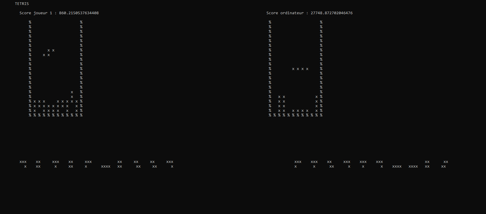
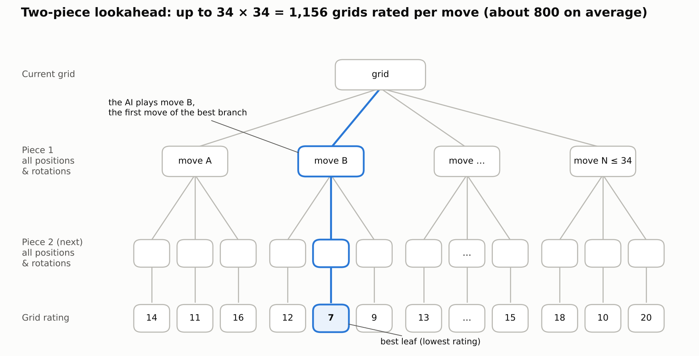
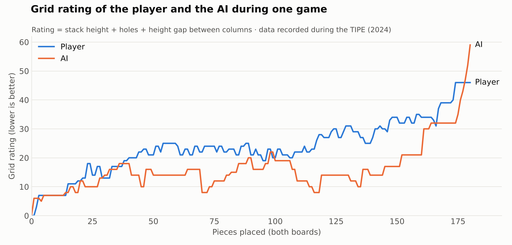

# Tetris AI

Terminal Tetris where you play against an AI that adapts its level to yours.



*The player (left) and the AI (right) each play on their own grid.*

## Overview

This project comes from a TIPE (a research project in the French *classes préparatoires*, MP track, 2023-2024) titled *"Optimisation de l'expérience de jeu dans Tetris : conception d'un algorithme d'adaptation du niveau de l'adversaire"*. In English: *Optimising the gaming experience in Tetris: designing an algorithm that adapts the opponent's level*.

The game runs in the terminal. The player and the AI play side by side on two separate grids. Each grid is a 10x20 play area surrounded by walls, and the next 10 pieces are displayed under each grid.

The code was republished in 2026 and is now managed with [uv](https://docs.astral.sh/uv/).

## How the AI works



*Search tree over two pieces. The scores are illustrative.*

### Exhaustive search over two pieces

For each move, the AI knows its current piece and the next one. It builds a tree of every possible outcome:

1. It lists every rotation of the current piece in every column, and drops the piece to its landing position.
2. For each resulting grid, it does the same with the next piece.
3. It rates every grid at the bottom of the tree.

A piece has up to 34 placements (17 for the I piece, 9 for the O piece). The AI evaluates about 800 grids per move on average, and up to about 1150.

### Grid evaluation

A grid is rated by the sum of three values. The lower the sum, the better the grid.

- The height of the stack.
- The number of holes: empty cells with a filled cell somewhere above them.
- The gap between the highest and the lowest column.

### Choosing the move

The AI finds the grid with the best rating in the tree. It plays the first move of the branch that leads to it.

### Adaptive difficulty

Before each move, the AI compares both grids. It computes:

```
gap = rating(player grid) - rating(AI grid)
```

A high gap means the player's grid is in worse shape than the AI's. The `choose_path` function in [bot.py](src/tetris_ai/bot.py) then selects the move:

| Gap | Move played |
|---|---|
| below 1 | Best move |
| from 1 to 8 | Random move |
| above 8 | Worst move |

The AI plays its best when it is not ahead of the player. It plays randomly when it is slightly ahead, and it deliberately plays badly when it is far ahead.

## Results



*Grid rating of the player and the AI during one game. Data recorded during the TIPE (2024 version of the code).*

In this game, the AI most often keeps a cleaner grid than the player. Its rating then rises sharply at the end of the game. This is a single recorded game, so it shows a tendency and not a measurement.

The data comes from the 2024 version of the code, whose difficulty thresholds differed slightly from the current ones.

## Installation & usage

> **Warning: Windows only.** Run the game in the Command Prompt (`cmd`). It does not work in Git Bash (display problems) or on macOS (the `keyboard` library).

Prerequisites:

- Windows
- [uv](https://docs.astral.sh/uv/)

```
git clone https://github.com/Leonard-ROGER/tetris-ai.git
cd tetris-ai
uv run tetris
```

The terminal size is read once at startup. Open a large window before launching the game. The next pieces are drawn on row 35, so the window needs at least 38 rows.

## Controls

| Key | Action |
|---|---|
| Left arrow | Move the piece left |
| Right arrow | Move the piece right |
| Up arrow | Rotate the piece |
| Down arrow | Fast drop (hold the key) |

Left, right and up act once per key press. Holding the key does not repeat the action.

The pieces fall every 0.5 s at the start. Every 15 s, the delay is multiplied by 0.93. The down arrow divides the delay by 10 while it is held.

## Scoring

Clearing 1, 2, 3 or 4 lines with one piece adds 100, 300, 500 or 800 points respectively, multiplied by `2 / speed`, where `speed` is the current delay between two descents in seconds (see `add_score` in [core.py](src/tetris_ai/core.py)).

## Project structure

```
tetris-ai/
├── src/
│   └── tetris_ai/
│       ├── __init__.py    Package marker
│       ├── game.py        Main loop, keyboard input, speed, drawing of both games
│       ├── bot.py         The AI: tree search, grid rating, adaptive difficulty
│       ├── core.py        Game rules: grid, pieces, collisions, rotation, line clearing, scoring
│       └── renderer.py    Terminal rendering: draws a character image and prints it
├── analysis/
│   └── create_graph.py    Plots the data recorded during the TIPE (requires matplotlib)
├── docs/
│   └── images/            Images used in this README
├── pyproject.toml         Project metadata and the `tetris` command
└── LICENSE
```

At the end of a game, [game.py](src/tetris_ai/game.py) prints the grid ratings recorded after each placed piece. [analysis/create_graph.py](analysis/create_graph.py) plots such data. The values it contains are copied in the script, and its labels are in French. matplotlib is not a dependency of the project.

## Known limitations

- Windows only.
- The texts of the game are in French.
- The end of the game does not always trigger.
- The speed can stay 10 times faster if the down arrow is held at the moment of the speed increase (every 15 s).
- The score of completed lines is counted twice.

## Future work

- A difficulty curve: choice of the pieces, speed linked to the score.
- New mechanics: new pieces, special powers.
- A graphical interface.

## References

- N. Böhm, G. Kókai, S. Mandl, "An Evolutionary Approach to Tetris" (heuristics).
- H. Burgiel, "How to Lose at Tetris", *The Mathematical Gazette*, 1997.
- R. E. Korf, "Multi-player alpha-beta pruning", *Artificial Intelligence*, 1991.
- S. Algorta, Ö. Şimşek, "The Game of Tetris in Machine Learning", arXiv:1905.01652, 2019.

## License

MIT. See [LICENSE](LICENSE).
